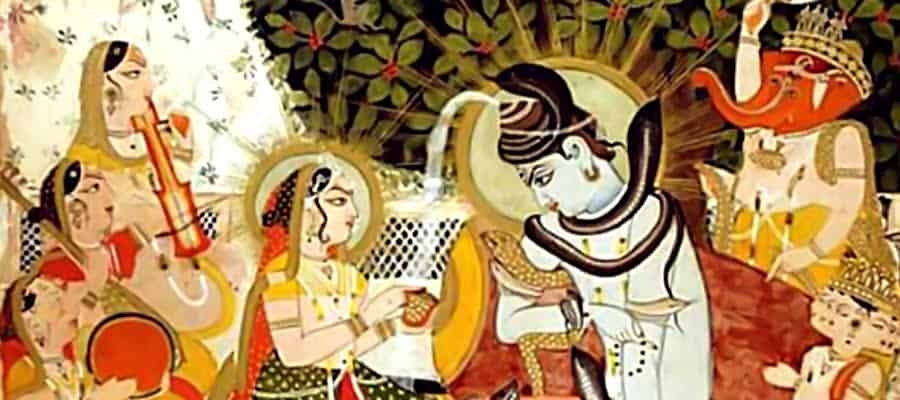
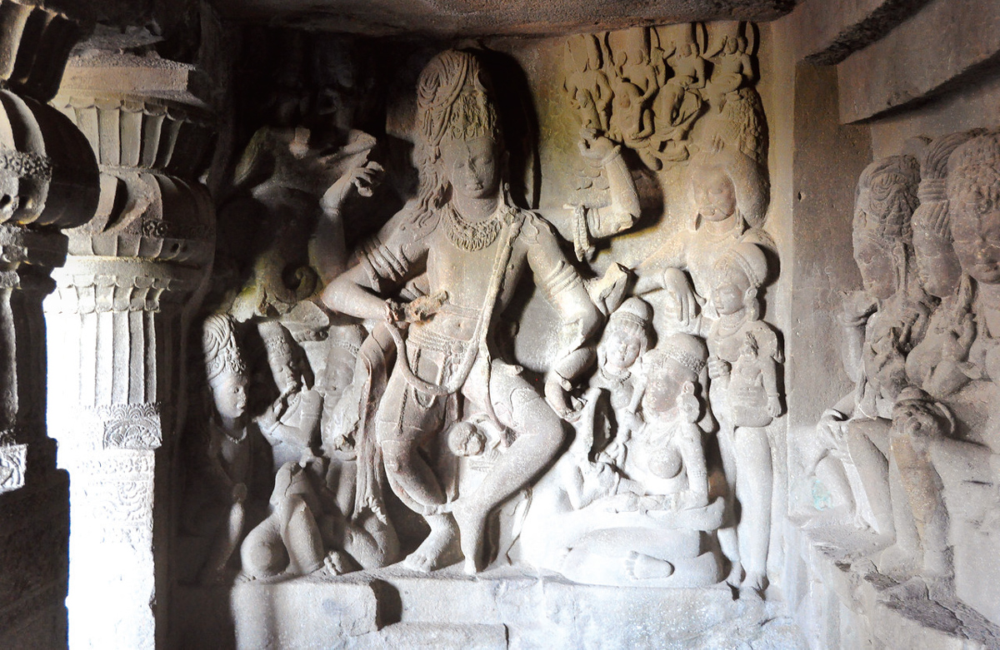

#### भारतीय ज्ञान एवं साधना की धारा वैदिक और आगम दो रूपों में प्रवाहित होती आ रही है। वैदिक प्रवाह का मूल यदि भगवान् स्वच्छंदनाथ भैरवजी के एक मुख वामदेव का उच्छ्वास है, तो आगमिक या तान्त्रिक प्रवाह का मूल भगवान् स्वच्छंदनाथ भैरवजी के पंच मुखों कि वाणी है, और इनसे उत्पन्न—भैरवागमधारा—अनादि; अभेद; स्वतन्त्र और गुप्त है; और यह धारा सदैव भगवान् स्वच्छंदनाथ भैरवजी की अनुग्रहीक कृपा से कार्यांवित होती है। 

#### इसके पश्चात रुद्रागम जो भेदाभेद और शिवागम जो भेद इत्यादी धाराये है। परवर्ती काल में यह दोनों (रुद्रागम जो भेदाभेद और शिवागम जो भेद) और वैदिक इत्यादी धाराओं के अनुयायी परस्पर प्रभावित हुए और एक के सिद्धान्त आचार और व्यवहार दूसरे के सिद्धान्त आचार व्यवहार से अंशतः मिश्रित हो गये। फलतः एक मिश्रित आचारपरम्परा चल पड़ी। वैदिक वाङ्मय में रुद्रसूक्त; श्वेताश्वतर; पाशुपत; ब्रह्म; त्रिपुरातापिनी; त्रिपुरा; कठरुद्र; भावना आदि उपनिषदें तथा तान्त्रिक उपासना एवं साधना में वैदिक मन्त्रों का प्रयोग इन्ही व्यवस्थाओं की देन है। ऐसा होने पर भी तान्त्रिक वाङ्मय के अपने कुछ मूलभूत सिद्धान्त हैं जो वैदिक वाङ्मय से इसे सर्वथा विशिष्ट और सिद्ध करते हैं।

#### विश्व के मूल में परमसत्ता को सभी मत किसी न किसी रूप में स्वीकार करते हैं। “त्रिकहृदय” और “त्रिकशासन” उन सभी मतोंका मूलभूत आधार है। यहाँ जिस परमसत्ता का स्वीकार किया गया है वह अखण्ड है। पूर्णतत्त्व की जो गंभीरतम स्थिति है उसमें चिदाआनन्द की कल्पना असम्भव है। वह निरंश अनुत्तर परा स्थिति है। इस गंभीरतम सन्मात्र की स्थिति में आत्मप्रकाश के रूप में इसी परमसत्ता की एक कला प्रस्फुरीत होती है जिसे त्रिक की भाषा में चित् या चिति कहा जाता है। उसका यह चिद्भाव उसकी बहिरुन्मुखता का आदि प्रकाश है। इसे भैरवागमोंकी भाषा में “अनुत्तर” कहते हैं। 

#### संस्कृत भाषा का अथवा शिव सूत्र की मात्रृकाचक्र का “अ” इसी का प्रतीक है। उस परमसत्ता से यह चिद्भाव शाश्वत निकलता रहता है। आनंद में स्पन्दन के कारण जिस प्रकार चित् का बहिर्भाव होता है उसी प्रकार चित् में भी स्पन्दन होता है। इस स्पन्दन के फलस्वरूप एक ओर चित् आनंद को पकड़े रहता है; तो दूसरी ओर उससे द्वितीय चित् उत्पन्न होता है। यह द्वितीय चित् जब प्रथम चित् में प्रतिबिम्बित होता है तब अपने स्वरूप को देखता है। उसकी अपनी सत्ता की यही पहचान या अनुकूल संवेदन “आनन्द” कही जाती है। 

#### व्यवहार जगत् में यह दर्पणगत प्रतिबिम्ब की स्थिति जैसी है; परंतु यह दर्पणगत प्रतिबिम्ब शिव से अंशतः अभेद होता है। इस निर्वचन से यह सिद्ध होता है कि अखण्ड सत्ता चित्स्वरूप है। यह सत्ता स्वतन्त्र अर्थात अन्यनिरपेक्ष है। सत्यं शिवं सुन्दरम से इसी सत्ता का अभिव्यञ्जन होता है। यह विशुद्ध शिव की अभिव्यक्ति की दृष्टि से चित् तथा रसास्वाद की दृष्टि से आनन्दस्वरूप है। यही त्रिक शासन के अनुसार परमशिव और परमशक्ति हैं और दोनो अभेद है। दोनों चिद्रूप है और उसी प्रकार अभिन्न हैं जैसे अग्नि और उसकी दाहकता शक्ति। 

#### यही परम साम्य “यामल” अथवा “समावेश” की स्थिति है। इसमें लिङ्गभेद नहीं है। यद्यपि यह अभेद की स्थिति है तथापि भेददृष्टि रखनेवाले अनु को इसमें भेद दिखाई पड़ता है। जागतिक दृष्टिकोण से “परभैरव” सर्वदा पञ्चकृत्यकारी है।

## “त्रिकशासन” उपनाम त्रिकाचार: 
### वेदाचार, वैश्नवाचार, शैवाचार, दक्षिणाचार, वामाचार, सिद्धान्ताचार, कौलाचार यह सारे आचारोंका क्रम साधक को सर्वोच्च “त्रिकाचार” मे बढाने के लिये है। 

#### “त्रिकशासन स्वतंत्र्यवाद” के दो पक्ष हैं:— १] दार्शनिक पक्ष और; २] साधना पक्ष। 
#### दार्शनिक पक्ष का विश्लेषण भगवान श्री महामहेश्वर सोमानन्द, भगवान श्री महामहेश्वर भट्टकल्लटजी, भगवान श्री महामहेश्वर वासुगुप्तजी, भगवान श्री महामहेश्वर उत्पलदेवजी, भगवान श्री महामहेश्वर अभिनवगुप्तजी जैसे महान “त्रिकहृदय–सिद्ध” गुरुजनोंने प्रत्यभिज्ञा एवं स्पन्द; क्रम; कुल के साथ सम्बन्धित शिवदृष्टि, ईश्वरप्रत्यभिज्ञा, स्पन्दकारिका, तंत्रलोक इत्यादि दार्शनिक ग्रन्थों में किया है। साधना पक्ष के पेचीदा आध्यात्मिक रहस्यों को गुरूदेव भगवान श्री महामहेश्वर अभिनवगुप्तः जी के तन्त्रालोक और श्रीपरात्रिंशिका, श्री स्वच्छन्दतन्त्र इत्यादि बहुतेरे भैरवागम ग्रन्थों में समझाया गया है। दार्शनिक पक्ष में जिन मूल सिद्धान्तों की स्थापना अनेक प्रकार की तार्किक युक्तियों के द्वारा की गई है वह सर्वमान्य और निश्चित रही है। उन सिद्धान्तों में आज तक भी किसी स्तर पर कोई परिष्कार या अन्यथाकरण नहीं हुआ है। इसके प्रतिकूल साधना पक्ष के, प्राचीन काल से ही, बहुतेरे रूप रहे हैं। दार्शनिक पक्ष में समझाए गए आध्यात्मिक तथ्यों को अनुभव में लाने के लिए भिन्न-भिन्न त्रिक सिद्ध गुरुओं ने भिन्न-भिन्न प्रकार के साधना मार्गों को अपनाया और तदनुसार ही शिष्यों को भी दीक्षित किया। इन भिन्न-भिन्न प्रकार के साघना मार्गों को आचारों का नाम दिया गया। त्रिकाचार भी इन्हीं आचारों में से एक प्रधान आचार है, और कश्मीर का शैव “त्रिकशासन” परम्परा संपूर्णतः “अभेद–त्रिकाचार” कहलाता है।

